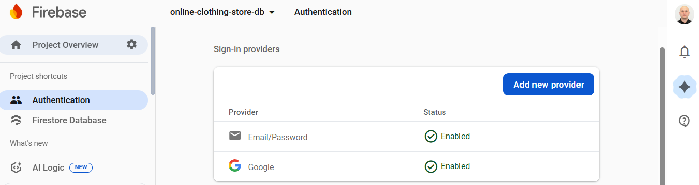
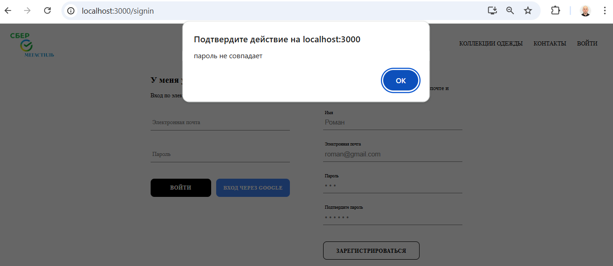
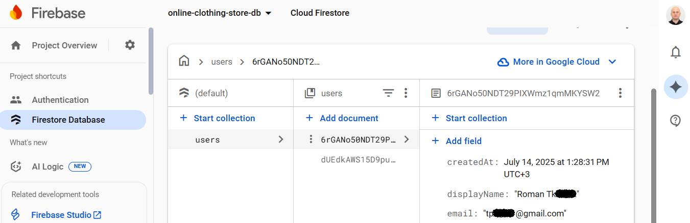
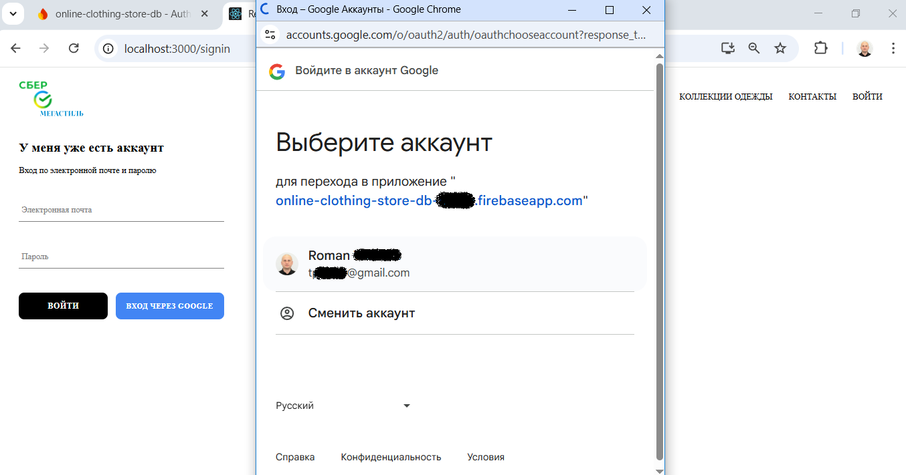
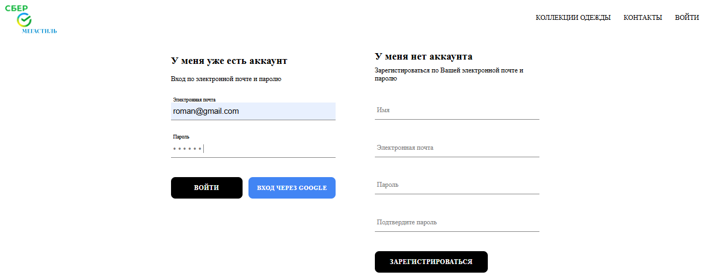
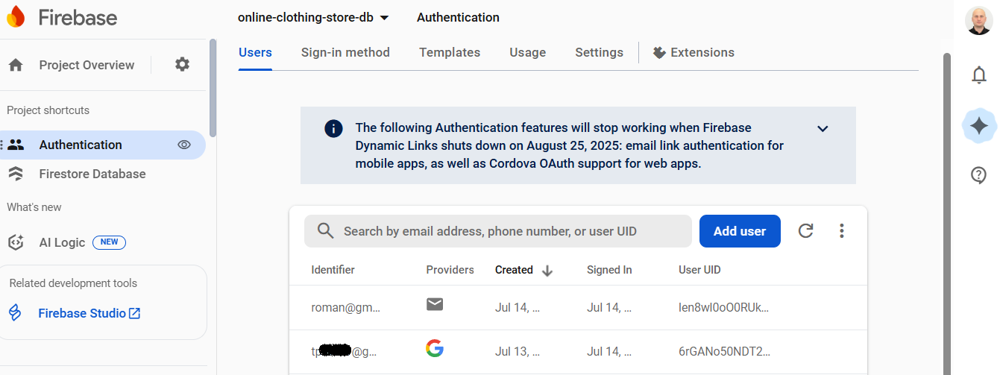

# online-clothing-store (онлайн магазин одежды)

Описание: 
Это многостраничное приложение для электронной коммерции, похожее на онлайн-магазин одежды Shopify. 
Приложение "Онлайн-магазин одежды" построено на библиотеке React с использованием библиотеки Redux для управления состоянием. 
Первым экраном приложения является домашняя страница (компонент homepage), состоящая из компонента каталога (компонент directory) в виде меню из 5 элементов меню в виде компонентов (компонент menu-item). При наведении курсора на элемент меню, добавляется белый фон контенту, изменяется прозрачность, реализуется эффект увеличения картинки фона - это делает интерфейс "живым" и современным, белый фон улучшает читаемость, увеличивающаяся картинка привлекает внимание и направляет взгляд пользователя, подсказывая пользователю, что элемент кликабелен. 
В верху, не важно на какой странице находится пользователь, располагается шапка (компонент header), содержащая логотип и главное меню. Это простой способ навигации между страницами. Главное меню включает пункты: Коллекции одежды, Контакты, Вход/Выход, Корзина. 
При выборе пункта меню "Коллекции одежды" осуществляется переход на страницу магазина с предпросмотром доступных коллекций одежды (компонент shop). Для каждой категории одежды отображаются 4 элемента (компонент collection-preview), а также ссылка на эту категорию. Если ее нажать, произойдет переход на страницу конкретно этой категории одежды. При наведении пользователем курсора на понравившийся товар, на выбранном элементе появляется кнопка "Добавить в корзину", при нажатии на которую происходит добавление товара в корзину. 
Корзина представлена иконкой с номером количества товара внутри (компонент cart-icon). При добавлении/удалении пользователем товара в корзину/из корзины, число внутри иконки увеличивается или уменьшается соответственно. При нажатии на иконку корзины, появляется выпадающее меню (компонент CartDropdown), состоящее из секции элементов внутри (компонент cart-item: фото и описание товара, количество товара, общая стоимость), скролла, а также кнопки "Перейти к оплате". При повторном назатии на иконке "Корзина", выпадающее меню скрывается. При нажатии на кнопку "Перейти к оплате", пользователь переходит на страницу оплаты, где также отображаются фотографии товаров, их описание, количество, общая стоимость. На этой странице также можно добавлять/удалять товар, при этом синхронно будет увеличивать/уменьшаться номер количества товара внутри иконки "Корзина". 
При выборе пункта меню "Вход", реализуется переход на страницу регистрации (компонент sign up - создания аккаунта) и входа в аккаунт (компонент sign in - авторизации, аутентификация). Сохранение пользователя происходит в backend, для чего используется Firebase. Вход в приложение осуществляется по электронной почте и паролю на основании аккаунта, который предварительно создается с помощью формы sign up. Также для удобства пользователя реализована функция входа по профилю в Google. Используя вход по Google, загружается Gmail аккаунт пользователя, под которыми он уже входил, или он может использовать другой аккаунт. Благодаря этому процесс аутентификации значительно упрощается. 
В обоих компонентах sing in и sign up используется один и тот же компонент формы form-input (изменяются только параметры), один и тот же компонент кнопки custom-button (изменяется только стиль кнопки). Добавлена анимация transition для лейблов "Имя", "Электронная почта", "Пароль", "Подтвердить пароль" при кликании пользователем курсором на поле ввода. 
В приложение интегрирована Firebase для аутентификация пользователя (authentication) и для хранилища данных (storage). Firebase создан Google для эффективных запросов к базам данных, хранения данных, что обеспечивает очень простой способ аутентификации, которую создать с нуля очень тяжело. 
Firebase следит за экземплярами приложения, которые открыты и взаимодействуют с Firebase. Это все происходит до тех пор, пока пользователь не выйдет из приложения (sign out). Так сохраняется сеанс приложения. Firebase позволяет пользователю входить в стороннии сервисы (Facebook, Twitter, Github logins), так уменьшаются барьеры для пользователя по входу в приложение, ему не нужно проходить через долгий процесс входа с самого начала, например, он может просто использовать sign in with Google. Сохранение аутентифицированных пользователей, полученных от библиотеки authentication, осуществляется в базу данных. И только после этого данные сохранятются в state приложения. 
Компонент Redirect используется для блокировки возможности пользователю повторно получать доступ к формам регистрации и входа в приложение в случае, если он уже вошел в приложение. 
Для того, чтобы сделать state в приложении более масштабируемым, используется библиотека Redux для управления состоянием приложения, благодаря чему все компоненты приложения изолированы индивидуально, они получают только нужный им контекст, что делает код чистым и более простым для debugging. С использованием библиотеки Redux осуществлено управление состоянием при определении текущего залогиненного пользователя, реализации появления/скрытия выпадающего меню при нажатии иконки "Корзина", добавление товара в корзину при нажатии кнопки "Добавить в корзину". 
В проекте используется библиотека Reselect для кэширования значений селекторов. Селектор принимает state целиком и затем вытягивает небольшие кусочки slice этого state. Если output селектора не изменяется, то компоненты не перерисовываются, что значительно повышает производительность приложения. В противном случае, без использования селекторов, при обновлении любого reducer приложения, всегда бы возвращался новый объект, state перекомпозировался бы целиком, в компоненты передавались бы новые props, что в итоге приводило бы к перерисовкам компонентов.

**Домашняя страница:** 
 
**Страница магазина с предпросмотром доступных коллекций одежды:** 
 
**Добавление выбранного товара в корзину, просмотр добавленного товара в выпадающем меню иконки корзины:** 
 
**Firebase провайдеры для приложения:** 
 
**Регистрация пользователя в приложении:** 
 
**Создание пользователя в базе данных Firebase Datastore:** 
 
**Вход пользователя в приложение через Google аккаунт пользователя:** 
 
**Вход пользователя в приложение по электронной почте и паролю:** 
 
**Аутентификация пользователя в Firebase authentication:** 
 
